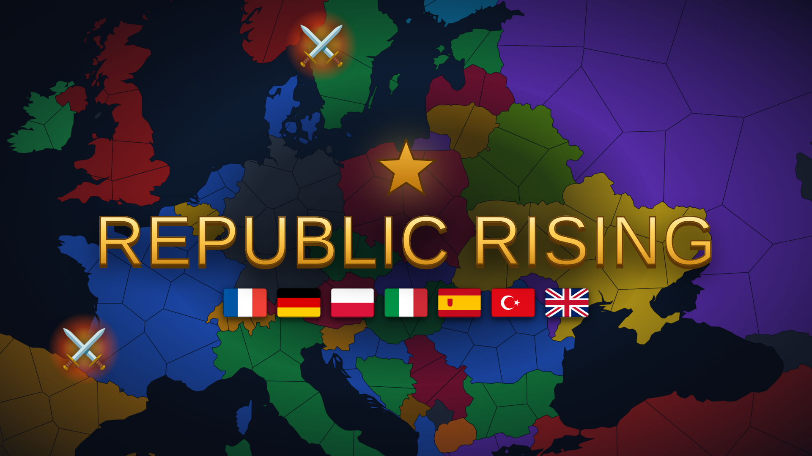
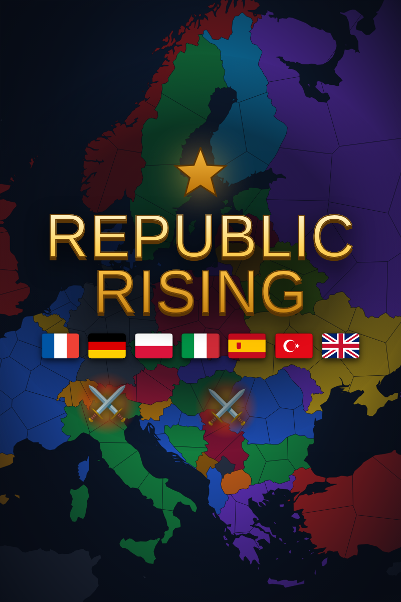
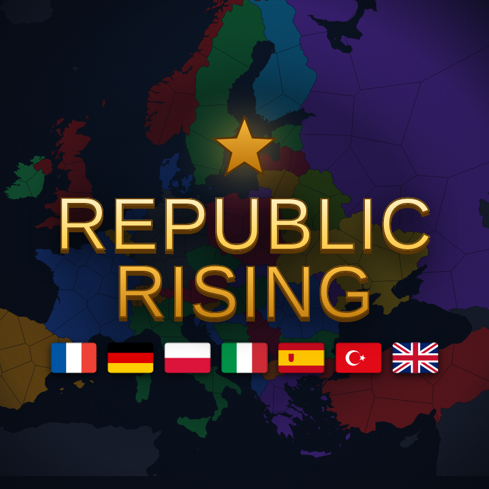
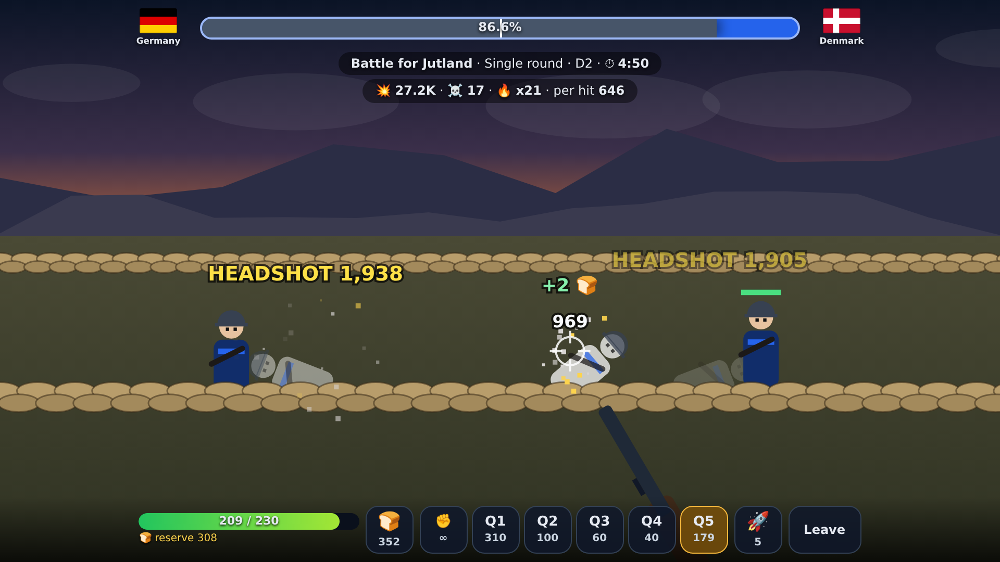
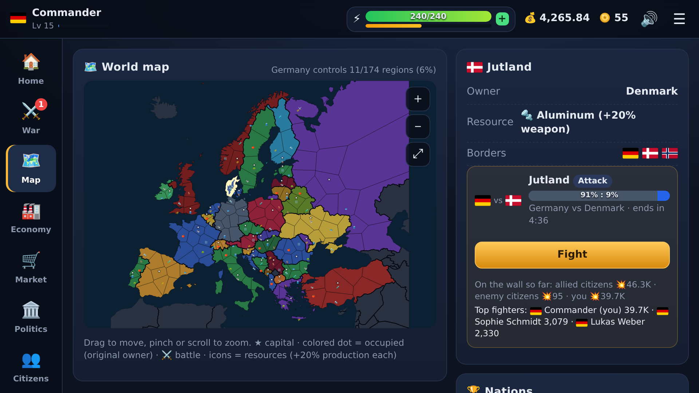
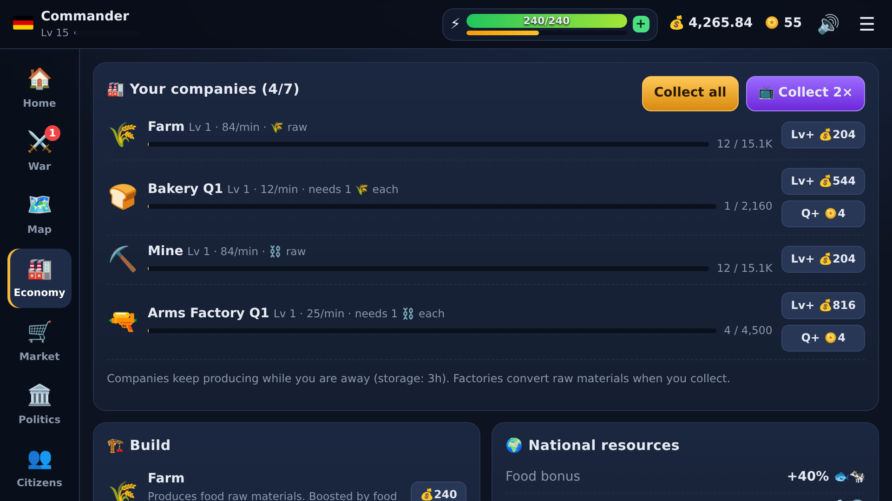
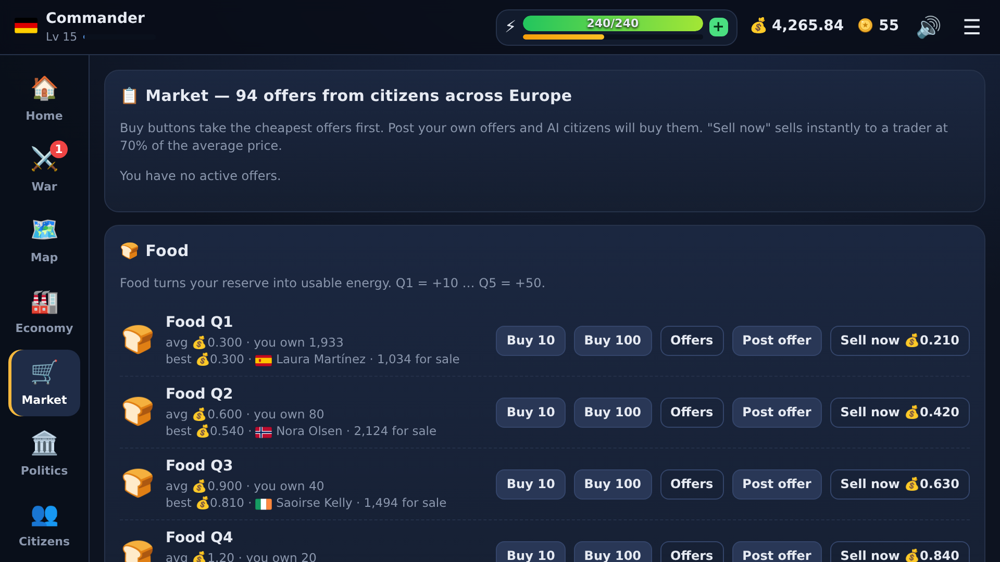
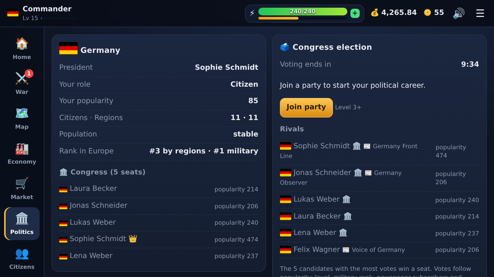
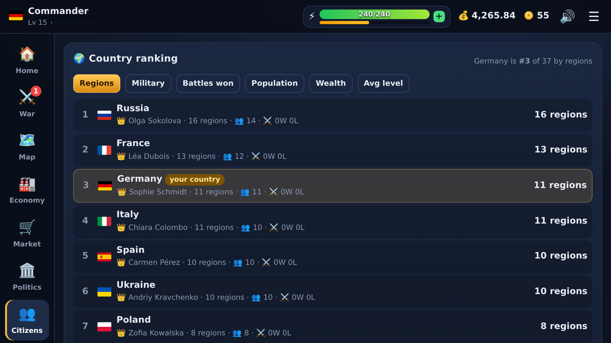

# Republic Rising — marketing kit

Political war strategy game on a real map of Europe: work, train and fight for your nation, build companies, trade on a living market and win elections against 200+ AI citizens. HTML5, desktop and mobile.

**Download everything:** [republic-rising-marketing-kit.zip](republic-rising-marketing-kit.zip)

## Preview videos (≈18 s, no audio)

| File | Size |
|---|---|
| [preview-landscape-1920x1080.mp4](videos/preview-landscape-1920x1080.mp4) | 1920×1080 (16:9) |
| [preview-portrait-1080x1620.mp4](videos/preview-portrait-1080x1620.mp4) | 1080×1620 (2:3) |

## Covers

| Landscape 1920×1080 | Portrait 800×1200 | Square 800×800 |
|---|---|---|
|  |  |  |

## Logo (transparent PNG, 2000×700)

## Screenshots (1920×1080)

| | |
|---|---|
|  |  |
|  |  |
|  |  |

## Key features

- Real map of Europe: 37 countries, 174 regions
- Fast 5-minute battles with headshots, combos and a bazooka
- 200+ AI citizens who work, trade, vote, publish newspapers and fight
- Companies, raw materials and a player-driven market
- Elections for Congress and President, national policies, newspapers
- Houses, training grounds, 69 military ranks, medals, daily rewards
- Automatic progress save with 3 career slots
